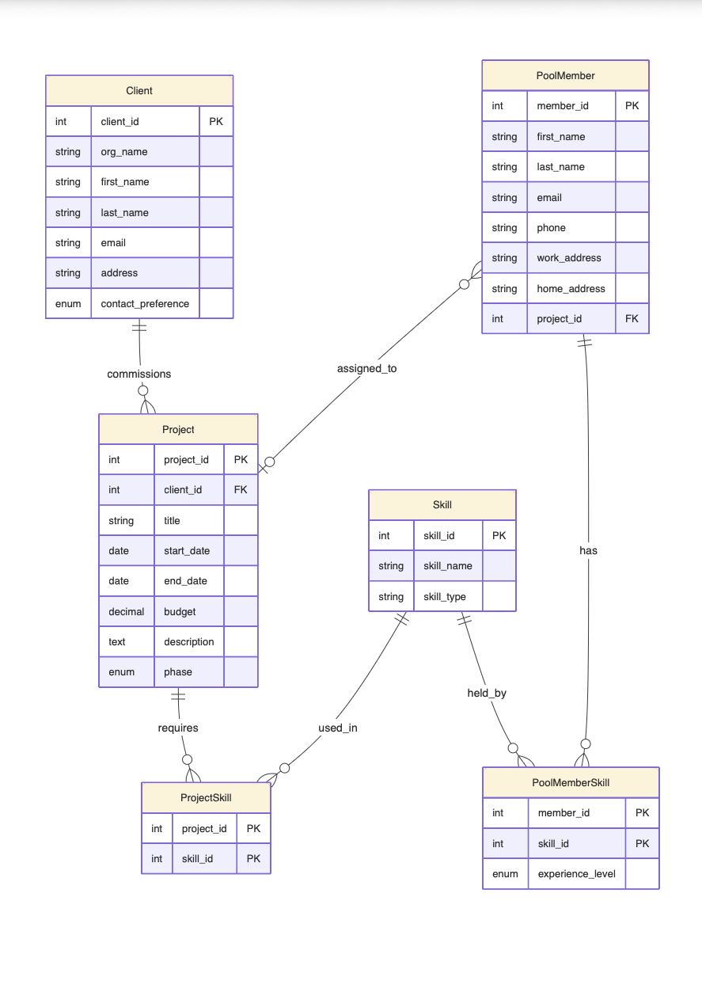

# 📊 Project Management Database (MySQL, 3NF)

A fully normalised (3NF) relational MySQL database for a software company’s project management system, designed to model clients, projects, staff, and skill-based assignments.

Built as part of the DG1IAD Internet Applications & Databases module at Aston University.

---

## Key Features

- Fully normalised relational schema to Third Normal Form (3NF)
- Models real-world relationships between clients, projects, staff, and skills
- Uses junction tables to handle many-to-many relationships
- Includes queries for inserts, updates, reporting, and skill-based staff matching
- Enforces data integrity with foreign keys, constraints, and controlled values

## Files

| File | Description |
|---|---|
| `schema.sql` | `CREATE TABLE` statements for the full database schema |
| `queries.sql` | `INSERT`, `UPDATE`, and `SELECT` statements |

## Entity Relationship Diagram

## Schema

The database consists of six tables, normalised to third normal form:

- **Skill** (stores skills and their type, for example Frontend, Backend, Design)
- **Client** (stores client organisations and contact preferences)
- **Project** (stores project details, including phase and budget, linked to a client)
- **PoolMember** (stores staff members available for assignment)
- **PoolMemberSkill** (junction table linking staff members to their skills and experience level)
- **ProjectSkill** (junction table linking projects to the skills they require)

## Queries

The repository includes SQL queries for:

- inserting seed data for skills, clients, pool members, and projects
- matching pool members to a project based on required skills
- assigning matched members to a project via `UPDATE`
- reporting pool members with their skills and experience levels
- reporting projects with assigned members and associated clients
- grouping skills by type

## What I Learned

- Designing a relational schema from scratch and normalising it to 3NF
- Using junction tables to model many-to-many relationships
- Writing subqueries and `JOIN` chains to match staff to project requirements
- Enforcing data integrity with foreign keys, `CHECK` constraints, and `ENUM` types
- Keeping SQL readable and maintainable without relying on GUI export tools

## Known Limitations

- The schema is designed specifically for MySQL, so some constraints may behave differently in other database engines
- No stored procedures or triggers are included, logic is handled at the query level
- The project focuses on database design and querying rather than application integration

## Running Locally

1. Create a new MySQL database  
2. Run `schema.sql` to create the tables  
3. Run `queries.sql` to insert seed data and execute the example queries  
